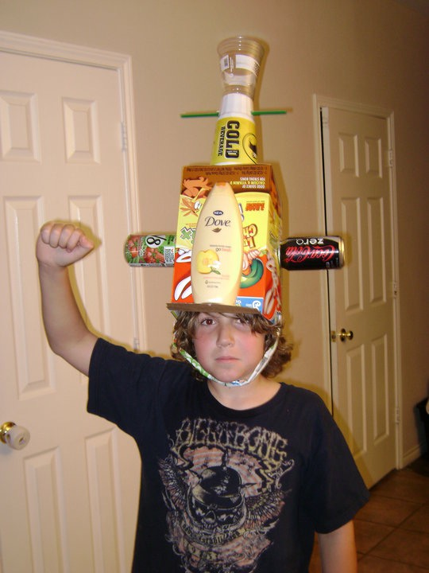

# JRRicher

Hey Friends, 
my name is Jacob! See the image below for example.

*Earth Day Circa 2010* 🌎

I am a server at the Board Room Game Cafe, I love playing guitar and have spent **WAY** too much money on Magic the Gathering!

## What is My Program?
I am majoring in Psychology and minoring in Religious Studies. This is *hopefully* my last semester of undergrad!

## Why This Course?
After taking data visualization using R with John Christie I found that writing code could be beautiful and became proud of my graphs 📊
This class feels like it will spark that same intrigue. Also, it fulfills a much-needed 3rd year course requirement.

## What Got My Interest in this Field?
As most psych students a bit of selfish curiosity and early childhood dysfunction.

## Plans for the Future
I am planning on enrolling into Nova Scotia's Primary Care Paramedicine program after I complete my undergrad. 

